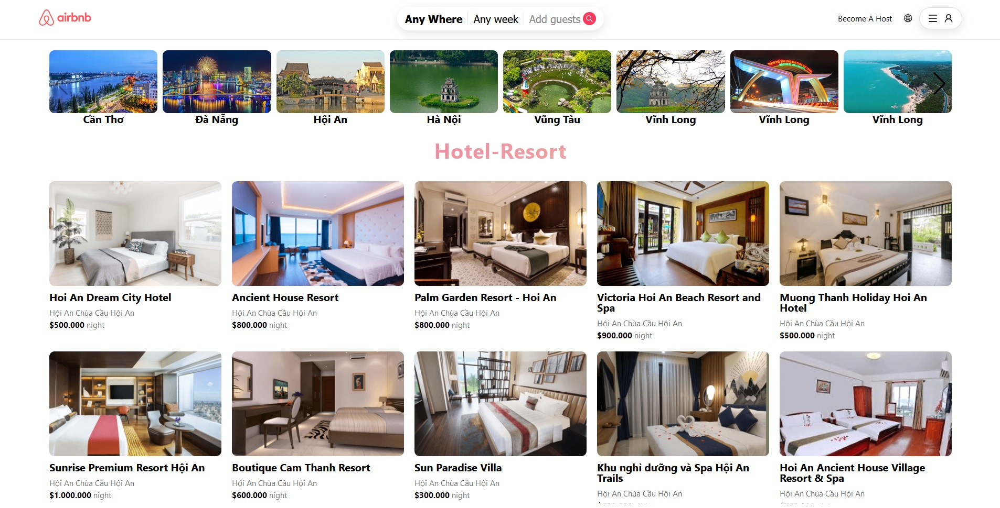

   

<h1 align="center">
    Project : AIRBNB
</h1>

<h2>
   Giới thiệu môn học   
</h2>

- **Mã lớp:** Bootcamp25

- **Giảng viên:** Đinh Phúc Nguyên
- **Mentor:** Trương Quý Hải

<h2>
   Giới thiệu bản thân
</h2>

**Thông tin thành viên**

<table align="center">
      <tr>
       <th>Họ và Tên</th>
       <th>Github</th>
       </tr>
      <tr>
       <td>Nguyễn Trần Thái Duy</td>
       <td>https://github.com/thaiduy1704</td>
     </tr>
</table>

<h2>
  Link trang web  : https://thaiduyairbnb.vercel.app
</h2>
<h2>
Link video demo : https://drive.google.com/drive/folders/1lytDqAHv8_hNnI2DGedDWKmF53ytc1J5?usp=sharing
   
</h2>
<h2>
 Giao diện
</h2>

**HomePage**

   

